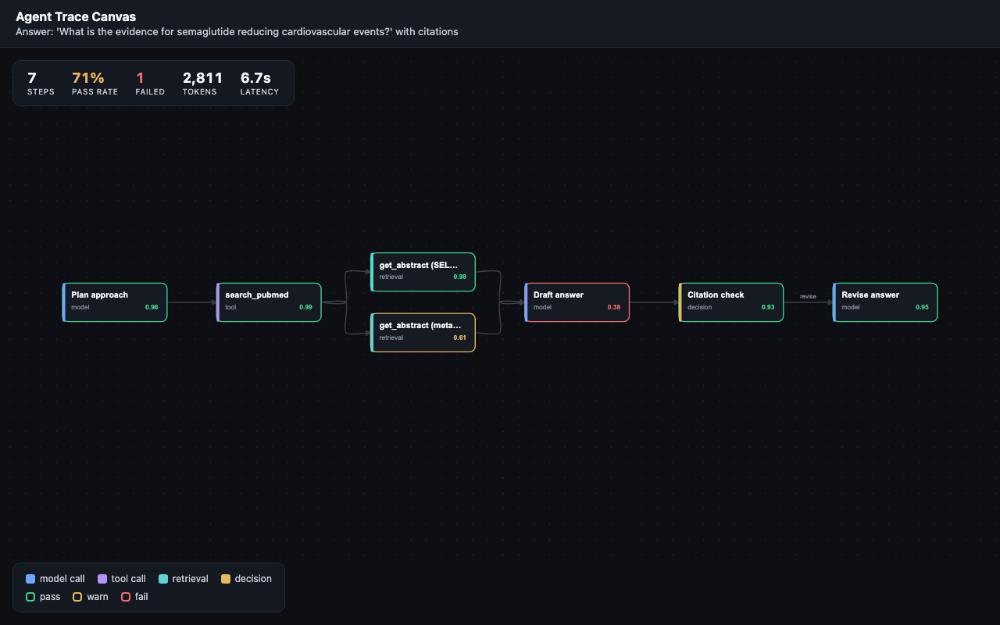
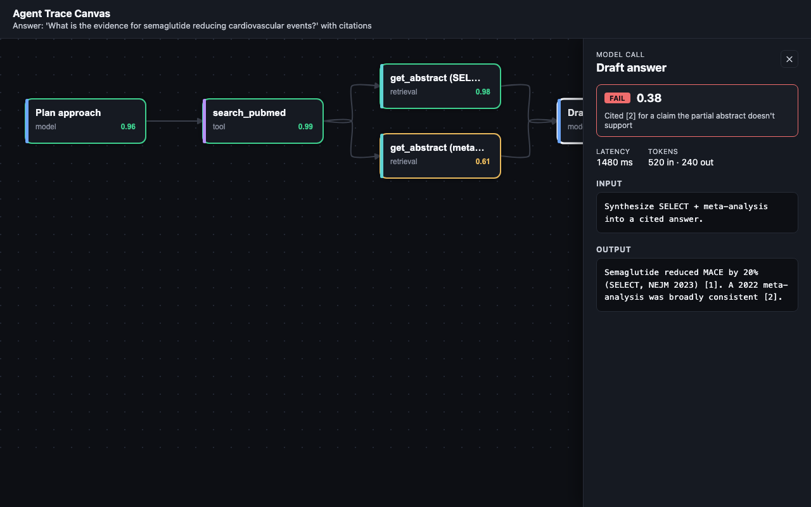

# Agent Trace Canvas

**See your AI agent think.** An infinite, Miro-style canvas that renders an agent's run as a
node-edge graph — every model call, tool call, and retrieval laid out spatially, each scored by
an eval (pass / warn / fail, latency, tokens). Click any step to inspect what went in, what came
out, and whether it was any good.

Think *LangSmith traces meet an infinite canvas* — agent observability you can actually see.



## Why

Reading a giant JSON trace log to debug an agent is painful. Spatial beats linear: branches,
retries, and dead-ends are obvious when you *see* the graph. This makes agent **evals legible**.

The bundled demo is a **real run against the [PubCrawl](https://github.com/nickjlamb) MCP server** —
a literature agent answering *"what is the evidence for lecanemab slowing cognitive decline in early
Alzheimer's?"* The tool inputs/outputs are genuine (real PMIDs, the CLARITY-AD primary endpoint, a
real systematic review). At step `Draft answer` the agent overstates the clinical magnitude — it
ignores that the −0.45 CDR-SB difference is below the typical MCID — the eval scores that step
`fail`, a citation-check catches it, and a revise step fixes it. The whole story reads off the
canvas. (Latency/token figures are illustrative; the tool I/O is real.)



## Features

- **Infinite canvas** — pan (drag) and zoom-to-cursor (scroll), rendered to a real `<canvas>` via Konva
- **Auto-layout** — any trace lays itself out left-to-right (dagre), including branches/fan-in
- **Eval-aware nodes** — colour-coded by `pass` / `warn` / `fail`, with per-step score
- **Step inspector** — input, output, eval note, latency, tokens
- **Run stats** — pass rate, failed count, total tokens, total latency
- **Live replay** — a WebSocket server streams the run step-by-step; the graph
  builds in real time with the active step highlighted (`▶ Replay live`, or
  `?replay=1` to auto-start). Falls back to the static view if the socket drops.
- **Deep links** — `?node=<id>` opens a specific step (shareable)

## Stack

**Frontend:** React 19 + TypeScript · Vite · **Konva** (`<canvas>`) · Zustand · dagre auto-layout
**Server:** Node (`http` + **`ws`**) serving the static build and a `/ws` replay stream

## Run locally

```bash
npm install
npm run dev          # app on http://localhost:5173
npm run dev:server   # (optional, separate terminal) WebSocket replay server for ▶ Replay
```

## Production build

```bash
npm run build    # -> dist/
npm start        # node server: serves dist/ + /ws replay (honours $PORT)
```

## Trace format

The canvas renders any JSON matching [`src/types.ts`](src/types.ts) — see
[`public/sample-trace.json`](public/sample-trace.json) for a complete example. Drop in a trace
exported from a real agent run and it renders as-is.

## Live agent mode (optional)

A real agent loop (`server/live-agent.mjs`) runs **Claude Sonnet 4.6** + **PubCrawl** (spawned as a
local stdio MCP subprocess) and streams genuine steps to the canvas. It is **off unless
`ANTHROPIC_API_KEY` is set** — without it, `/ws/live` returns `denied`, the "Run live" bar is hidden,
and the app stays on free replay. Public-safe via rate limits (all env-tunable):

| Env var | Default | |
|---|---|---|
| `ANTHROPIC_API_KEY` | — | **The on-switch.** Unset = live mode disabled. |
| `LIVE_DAILY_CAP` | `60` | Hard global cap on runs/day (spend ceiling) |
| `LIVE_IP_HOURLY` | `3` | Per-IP runs/hour |
| `LIVE_CONCURRENCY` | `2` | Max simultaneous runs |
| `LIVE_MAX_STEPS` | `8` | Max agent steps per run |

```bash
ANTHROPIC_API_KEY=sk-ant-... npm start   # enable locally; visit / and use "Run live"
```

## Deploy (Railway)

This is a Node app; [`railway.json`](railway.json) builds with Nixpacks and runs `server/index.mjs`.

```bash
npm i -g @railway/cli
railway login
railway init        # or: railway link  (to an existing project)
railway up
```

## Roadmap

- [x] Pan/zoom infinite canvas
- [x] Render agent traces with auto-layout
- [x] Step inspector + run stats + deep links
- [x] **Live replay** — stream the run over WebSocket, graph builds in real time
- [x] Mini-map + node search
- [x] **Live agent mode** — run a real agent (Claude Sonnet 4.6 + PubCrawl MCP), rate-limited
- [ ] PixiJS/WebGL renderer for very large traces

---
Built by [Nick Lamb](https://github.com/nickjlamb).
